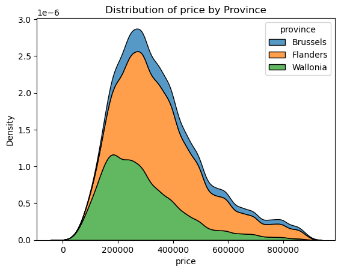

# immo-eliza-lions
Group project with Augustin &amp; Preeti to clean immoweb data and present EDA

# Description
This project is to clean the data and use some of the visualization libraries to get some idea about the nature of data.

Generate some good visuals with good stories behind them.

Make the data ready for the next step (Train Machine learning model) to predict house prices.

# Installation
For installations requirements.txt can be referred
requirements.txt

# Usage
Data folder contains =>
Original dataset : immoweb-dataset.csv
Cleaned dataset  : immoweb-dataset_cleaned.csv

reports folder contains => clean.py
All the cleaning is done in the clean.py

Analysis folder contains =>
All the visuals are generated in data_analysis.ipynb

# Visuals

# Contributors

  - Marc Van Goolen -  [GitHub](https://github.com/Marcvg69)/
  - Preeti - [GitHub](https://github.com/Preeti9392)
  - Augustin -[GitHub]()
# Timeline

It was a three days project
# Personal situation

We enjoyed working on this project together. It was a great experience working in a team and learning a lot of new tools and techniques.
