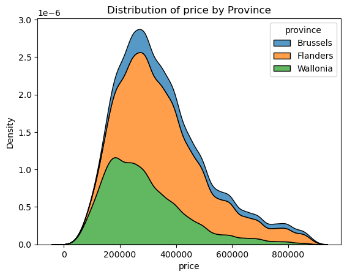

# immo-eliza-lions

Group project by  Augustin, Marc van Goolen and Preeti to clean immoweb data and present EDA.

# Description
This project is to clean the data and use some of the visualization libraries to get some idea about the nature of data.

Generate some good visuals with good stories behind them.

Make the data ready for the next step (Train Machine learning model) to predict house prices.
# Data
 Our data contains columns:
      ['Unnamed: 0', 'id', 'url', 'type', 'subtype', 'bedroomCount',
       'bathroomCount', 'province', 'locality', 'postCode', 'habitableSurface',
       'roomCount', 'monthlyCost', 'hasAttic', 'hasBasement',
       'hasDressingRoom', 'diningRoomSurface', 'hasDiningRoom',
       'buildingCondition', 'buildingConstructionYear', 'facedeCount',
       'floorCount', 'streetFacadeWidth', 'hasLift', 'floodZoneType',
       'heatingType', 'hasHeatPump', 'hasPhotovoltaicPanels',
       'hasThermicPanels', 'kitchenSurface', 'kitchenType', 'landSurface',
       'hasLivingRoom', 'livingRoomSurface', 'hasBalcony', 'hasGarden',
       'gardenSurface', 'gardenOrientation', 'parkingCountIndoor',
       'parkingCountOutdoor', 'hasAirConditioning', 'hasArmoredDoor',
       'hasVisiophone', 'hasOffice', 'toiletCount', 'hasSwimmingPool',
       'hasFireplace', 'hasTerrace', 'terraceSurface', 'terraceOrientation',
       'accessibleDisabledPeople', 'epcScore', 'price']

# Installation

```bash
git clone git@github.com:Marcvg69/immo-eliza-lions.git
cd immo-eliza-lions
```
```
To clean the dataset:

```bash
clean.py
```
To visualize the data:

```bash
data_analysis.ipynb
```

For installations requirements.txt can be referred
requirements.txt

# Usage
Data folder contains =>

Original dataset : immoweb-dataset.csv

Cleaned dataset  : immoweb-dataset_cleaned.csv


clean.py

All the cleaning is done in the clean.py


Analysis folder contains => data_analysis.ipynb

All the visuals are generated in data_analysis.ipynb

Figures folder contains:

All the figures generated
# Visuals



# Contributors

  - Marc Van Goolen -  [GitHub](https://github.com/Marcvg69)/
  - Preeti - [GitHub](https://github.com/Preeti9392)
  - Augustin -[GitHub](https://github.com/akameni)
# Timeline

It was a three days project

# Personal situation

We enjoyed working on this project together. It was a great experience working in a team and learning a lot of new tools and techniques.
